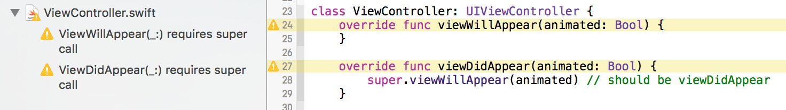

bansan
======

bansan checks swift code structures instead of your eyes.



## Checks Implemented

* requirements for super call of:
    * `viewDidLoad()`
    * `viewWillAppear(_:)`
    * `viewDidAppear(_:)`
    * `viewWillDisappear(_:)`
    * `viewDidDisappear(_:)`
* `lazy var` initialization caused in `deinit` whose initialization expression contains reference to `self`

## Usage

### Command Line

```
# bansan.swift is executable. Swift Package Manager will setup all for you.
./bansan.swift YourViewController.swift
```

### Xcode

```
ln -s /path/to/bansan.swift /path/to/bin/bansan
```

Add build phase to xcodeproject in current working directory:

```
bansan setup
```

or

Manually add `Run Script` Build Phase executed by `/bin/zsh`:

```
if which bansan >/dev/null; then
bansan ${SRCROOT}/**/*.swift
else
echo "warning: bansan does not exist, download from https://github.com/banjun/bansan"
fi
```

